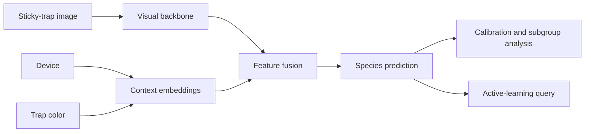

# Context-Aware Insect Recognition on Sticky Traps

[](https://github.com/AMIRMAHMOUDINIA/context-aware-sticky-trap-insect-monitoring/actions/workflows/tests.yml)


**Can an insect classifier remain reliable when the camera or sticky-trap background changes?**

This repository turns that question into a reproducible PyTorch experiment. It compares an image-only classifier with a context-aware model that also receives the acquisition device and trap color. The same models can then be evaluated under ordinary splits, unseen-device tests, unseen-color tests, and retrospective active-learning simulations.

I developed the project after working with field-based insect observations during my MSc. That experience made one point clear: biological measurements are rarely independent of how, when, and where they were collected. In image-based monitoring, acquisition context can be useful information, but it can also become a shortcut. This project is designed to examine both possibilities.

## Research questions

1. Does explicit device and trap-color context improve species classification or calibration?
2. Does context make the model more fragile when a new camera or background is encountered?
3. Can entropy-based sampling reach useful performance with fewer labeled images than random sampling?
4. Do Grad-CAM and subgroup error analysis indicate reliance on insect morphology or acquisition artifacts?



## Current status

| Component | Status |
|---|---|
| Data download and manifest tools | Implemented |
| Image-only and context-aware classifiers | Implemented |
| Group-aware and leave-one-domain-out splitting | Implemented |
| Metrics, calibration plots, subgroup outputs, and Grad-CAM | Implemented |
| Random versus entropy active-learning simulation | Implemented |
| Automated software tests | Included; 19 tests pass in the packaged validation run |
| Real-data benchmark results | **Not yet included** |

The included synthetic images are used only for software checks. They are not evidence of biological performance. Real claims should be made only after the public dataset has been downloaded, audited, and evaluated with documented splits and repeated seeds.

## What this project adds to the existing work

Ong and Høye used the same image resource to study the effects of trap color, imaging device, architecture, transfer learning, and Grad-CAM. Their work establishes that acquisition conditions can materially affect performance.

This repository takes a complementary direction by adding:

- explicit metadata fusion through learned context embeddings;
- neutral handling of unseen context categories;
- group-disjoint and leave-one-domain-out evaluation controls;
- calibration and context-specific subgroup metrics;
- retrospective active-learning comparisons at equal annotation budgets;
- saved split assignments, manifest checksums, predictions, and resolved configurations;
- an installable package with tests and continuous-integration configuration.

The aim is not to reproduce published performance numbers, but to provide a transparent framework for asking a different question: **when is context useful, and when does it become a source of shortcut learning?**

## Project at a glance

| Component | Implementation |
|---|---|
| Task | Two-class insect image classification |
| Visual backbones | ResNet-18, MobileNetV3-Small, EfficientNet-B0; TinyCNN for smoke tests |
| Context variables | Acquisition device and sticky-trap color |
| Robustness tests | Leave-one-device-out and leave-one-color-out |
| Data efficiency | Random sampling versus predictive entropy |
| Interpretation | Confusion matrices, reliability diagrams, subgroup metrics, Grad-CAM |
| Reproducibility | YAML configs, CLI entry points, tests, saved splits, checksums, model/data cards |

## Repository structure

```text
.
├── configs/                     # Reproducible experiment settings
├── data/                        # Data instructions; downloaded images are ignored
├── docs/                        # Dataset card, research rationale, and experiment plan
├── reports/                     # Generated metrics, predictions, and figures
├── scripts/                     # Download, manifest, audit, and smoke-test utilities
├── src/insect_context_ai/       # Installable Python package
├── tests/                       # Unit and end-to-end tests
├── .github/workflows/           # Continuous-integration configuration
├── MODEL_CARD.md
├── CHANGELOG.md
├── pyproject.toml
└── requirements.txt
```

## Installation

Python 3.10–3.12 is recommended.

```bash
python -m venv .venv

# Linux/macOS
source .venv/bin/activate

# Windows PowerShell
# .venv\Scripts\Activate.ps1

python -m pip install --upgrade pip
pip install -e ".[dev]"
```

Pretrained torchvision backbones download their ImageNet weights on first use. Set `pretrained: false` in a configuration when working offline.

## Quick software check

```bash
python scripts/make_smoke_dataset.py --output-dir data/smoke
python -m insect_context_ai.train --config configs/smoke.yaml
pytest -q
```

The generated scores only confirm that the software runs end to end.

## Public dataset

The planned benchmark uses the dataset published by Ong and Høye, containing red flour beetle (*Tribolium castaneum*) and rice weevil (*Sitophilus oryzae*) images acquired with DSLR, webcam, and smartphone systems on colored sticky-trap backgrounds.

The third-party images are not bundled with this repository.

### Download

```bash
python scripts/download_figshare.py \
  --article-id 23617383 \
  --version 2 \
  --output-dir data/raw/figshare \
  --extract
```

### Build and audit the manifest

```bash
python scripts/build_manifest.py \
  --image-root data/raw/figshare \
  --output data/metadata.csv

python scripts/audit_manifest.py \
  --manifest data/metadata.csv \
  --image-root data/raw/figshare \
  --output-dir reports/data_audit
```

The audit reports unreadable files, unsafe paths, unresolved labels, duplicate paths, and exact duplicate files. Every row marked for review must be checked before training. Related photographs of the same specimen or physical trap should receive the same `group_id`; the training pipeline rejects non-empty groups that cross evaluation splits by default.

## Main experiments

### Image-only baseline

```bash
python -m insect_context_ai.train --config configs/baseline_image_only.yaml
```

### Context-aware classifier

```bash
python -m insect_context_ai.train --config configs/context_aware.yaml
```

### Unseen-device evaluation

Set `data.holdout_value` in `configs/leave_one_device_out.yaml` and use a distinct `output_dir` for each device.

```bash
python -m insect_context_ai.train --config configs/leave_one_device_out.yaml
```

In a held-out domain, the unseen category is encoded as neutral zero context rather than as a random, untrained embedding.

### Unseen-trap-color evaluation

Set `data.holdout_value` in `configs/leave_one_color_out.yaml` and use a distinct output directory for each color.

```bash
python -m insect_context_ai.train --config configs/leave_one_color_out.yaml
```

### Active-learning simulation

```bash
python -m insect_context_ai.active_learning --config configs/active_learning.yaml
```

Random and entropy strategies begin each repeat from the same labeled subset and use paired training seeds at the same round, reducing seed-related confounding.

### Grad-CAM inspection

```bash
python -m insect_context_ai.explain \
  --checkpoint reports/context_aware/best.pt \
  --image data/raw/figshare/path/to/image.jpg \
  --device-label dslr \
  --trap-color yellow \
  --output reports/figures/gradcam_example.png
```

Grad-CAM is treated as a qualitative diagnostic, not as proof of causal or biological reasoning.

## Outputs

A training run writes:

- `best.pt` — best validation checkpoint (load only checkpoints you trust);
- `config_resolved.yaml` — exact experiment settings;
- `split_assignments.csv` — the train/validation/test allocation;
- `history.csv` and `training_history.png`;
- `metrics.json` — aggregate metrics and manifest SHA-256;
- `predictions.csv` — labels, probabilities, paths, and context variables;
- `subgroup_metrics.csv` — performance by device and trap color;
- `confusion_matrix.png`;
- `reliability_diagram.png`;
- `run_summary.md`.

Active-learning runs also write `learning_curve.csv` and `learning_curve.png`.

## Reproducibility and leakage control

The package supports predefined, stratified, group-aware, and leave-one-domain-out splits. It validates split fractions, rejects path traversal, checks class coverage, and records the resolved configuration, manifest checksum, and split assignments for each run.

A critical scientific boundary remains: group IDs must reflect the true acquisition structure. If the same specimen or trap appears under several devices or colors, the intended experiment must state whether this is a paired device-transfer design or a strict unseen-specimen test. The software cannot infer that biological grouping reliably from filenames alone.

## Limitations

- The source data contain only two stored-product pest species and controlled acquisition conditions.
- Classification of cropped insect images is not the same as detection and counting on full sticky traps.
- Results cannot be transferred directly to Belgian endive, carrot, or other crop systems.
- Context may improve familiar-domain performance while worsening robustness.
- Retrospective active learning does not reproduce all costs of real expert annotation.
- Open-set recognition, non-target arthropods, abundance estimation, and pest-risk decision support are outside the current scope.

## References

Ong, S.-Q., & Høye, T. T. (2024). *An annotated image dataset of pests on different coloured sticky traps acquired with different imaging devices*. **Data in Brief, 55**, 110741. https://doi.org/10.1016/j.dib.2024.110741

Ong, S.-Q., & Høye, T. T. (2025). *Trap colour strongly affects the ability of deep learning models to recognize insect species in images of sticky traps*. **Pest Management Science, 81**, 654–666. https://doi.org/10.1002/ps.8464

Dataset DOI: `10.6084/m9.figshare.23617383.v2`

## Author

Developed by **Amir Mohammad Mahmoudinia** as an independent research project connecting insect monitoring, agricultural data, and reproducible computer vision.

## License

The code is released under the MIT License. The external dataset has its own license and citation requirements; consult the Figshare record before use.
